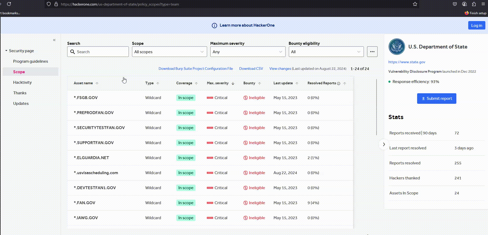

# 🔫 BrutScope Extractor

A Firefox/Chrome extension for bug bounty hunters and pentesters. Extract wildcard (`*.example.com`) and standard domains from any webpage—excluding the current host—and export them line by line. 🚀

## ✨ Features

- 🕵️‍♂️ Scrapes wildcard and normal domains from any page  
- ❌ Automatically excludes the current page’s domain  
- 📥 Download results as `domains.txt`  
- 📋 Copy domains to clipboard with one click  
- ⚙️ Zero configuration

## 🛠️ Installation

### 🦊 Firefox (Add-on Store)

1. Go to: https://addons.mozilla.org/addon/brutscope-extractor  
2. Click **Add to Firefox**  

### 🌐 Chrome (Manual)

1. Clone this repo:  
   ```bash
   git clone https://github.com/yourusername/brutscope-extractor.git
   cd brutscope-extractor
   ```  
2. Open `chrome://extensions` in Chrome  
3. Enable **Developer mode**  
4. Click **Load unpacked** and select this folder  

### 🦊 Firefox (Manual)

1. Clone this repo (see above)  
2. Open `about:debugging#/runtime/this-firefox` in Firefox  
3. Click **Load Temporary Add-on…** and select `manifest.json`  

## 🚀 Usage

1. Navigate to a bug bounty scope page (HackerOne, Bugcrowd, etc.)  
2. Click the **BrutScope Extractor** icon  
3. Click **Copy to Clipboard** or **Download Domains**



## 🤝 Contributing

1. Fork the repo  
2. Create a branch: `git checkout -b feature/YourFeature`  
3. Commit: `git commit -m "feat: Add YourFeature"`  
4. Push: `git push origin feature/YourFeature`  
5. Open a Pull Request  

## 📄 License

MIT License — see [LICENSE](LICENSE) for details.  
